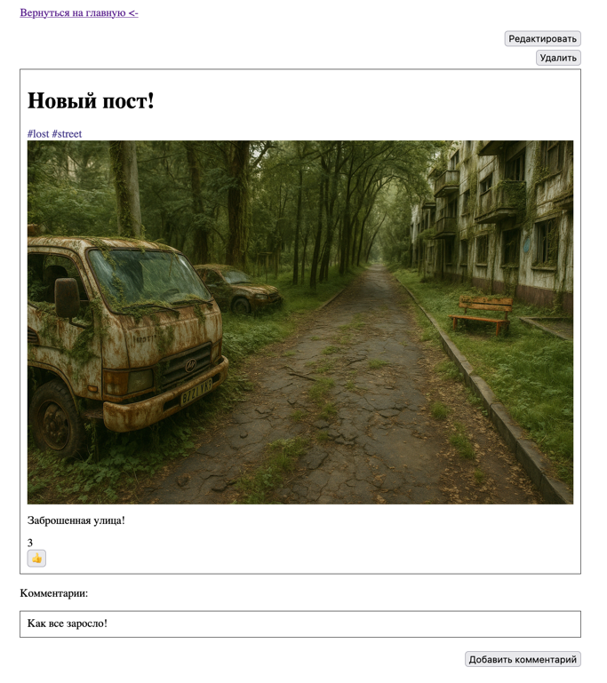

# Блог-лента постов

Данный проект представляет из себя ленту постов с возможностью их создания, редактирования, удаления. Лента постов может настраиваться - может быть указан поиск по конкретному тегу, количество постов на одной странице.

Каждый пост представляет из себя название, теги, картинку и текст. Название поста кликабельно и открывает его полную страницу.

Постам можно ставить лайки и добавлять коментарии. Каждый комментарий можно отдельно редактировать и удалять.

**Скриншоты:**\



### Для запуска проекта нужно использовать:
 - Контейнер сервлетов
 - Java 21+
 - H2DB

### Сборка:
Перед сборкой проекта необходимо переименовать файл `database-application.properties.in`, лежащий по пути `/resources/properties/` в `database-application.properties`.
Затем необходимо указать данные для подключения к базе данных.\
**Пример:**
```properties
spring.datasource.url=jdbc:h2:mem:postsdb;DB_CLOSE_DELAY=-1;DB_CLOSE_ON_EXIT=FALSE
spring.datasource.username=sa
spring.datasource.password=
```

Далее необходимо выполнить сборку проекта используя команду
```shell
mvn clean package
```
В созданном архвите `target` будет находится файл `PostsProject.war`. Данный файл необходимо переместить в каталог `webapps` контейнера сервлетов.

Лента постов будет доступна по адресу `адрес_и_порт_контейнера_сервлетов/PostsProject/posts`